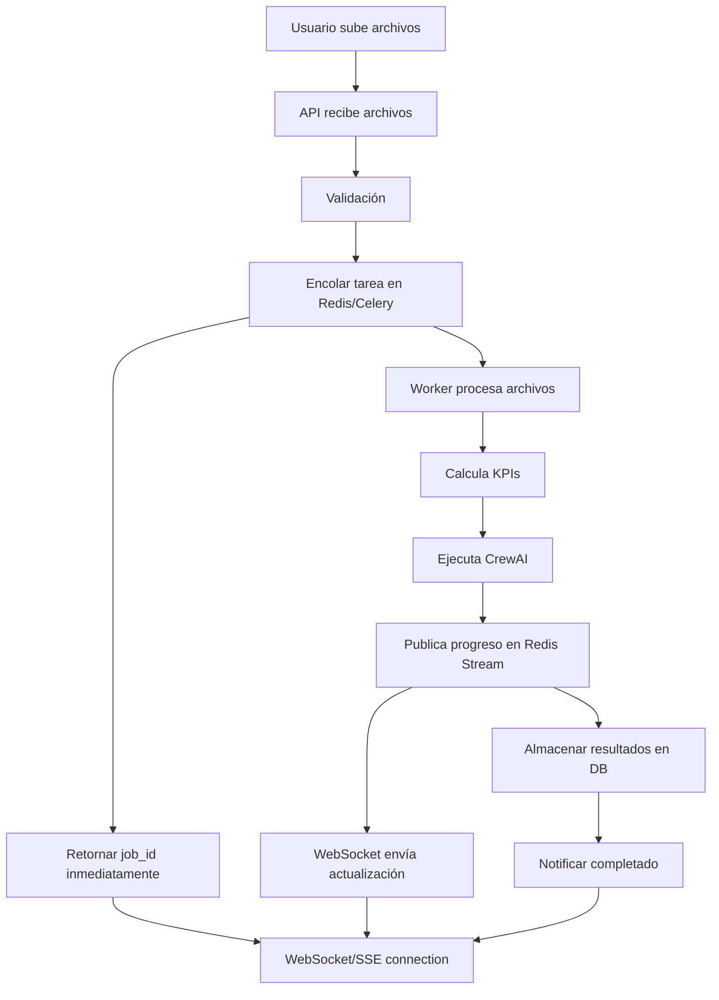

# REQUIREMENTS.md

## Company Efficiency Optimizer - Documentación Técnica Completa

---

## 1. Visión General del Proyecto

### 1.1 Objetivo del Proyecto

**Company Efficiency Optimizer** es una aplicación web de producción lista para optimizar la eficiencia empresarial, construida con Flask y CrewAI. El sistema analiza estados financieros, métricas de recursos humanos y KPIs operacionales para identificar ineficiencias y proporcionar recomendaciones accionables mediante agentes de IA especializados.

El sistema utiliza análisis de datos financieros, cálculo de KPIs, comparación con benchmarks de la industria y generación de diagnósticos mediante un sistema multi-agente basado en CrewAI y Ollama.

### 1.2 Tecnologías Utilizadas

#### Backend
- **Framework Web**: Flask 3.0.0+
- **Framework Multi-Agente**: CrewAI 0.203.1
- **Herramientas CrewAI**: crewai-tools 0.76.0
- **LLM Local**: Ollama (llama3.1:8b, llama3.2:3b)
- **Integración LLM**: langchain-ollama 0.1.0+
- **Validación de Datos**: Pydantic 2.4.2+

#### Procesamiento de Datos
- **Análisis de Datos**: pandas 2.0.0+, numpy 1.24.0+
- **Procesamiento de Archivos**: 
  - PDF: pytesseract 0.3.10+, pdf2image 1.16.0+, Pillow 10.0.0+
  - Excel: pandas (nativo)
  - CSV: pandas (nativo)

#### Base de Datos y Memoria
- **Base de Datos Vectorial**: Pinecone 3.0.0+ (memoria a largo plazo)
- **Base de Datos Relacional**: SQLAlchemy 2.0.0+ (SQLite para desarrollo)
- **Sesiones**: Flask-Session 0.5.0+

#### Infraestructura y Seguridad
- **Servidor Web**: Werkzeug 3.0.0+
- **Seguridad**: Flask-Talisman 1.1.0+, cryptography 41.0.0+
- **Rate Limiting**: Flask-Limiter 3.5.0+
- **Validación de Formularios**: Flask-WTF 1.2.0+

#### Utilidades
- **Configuración**: python-dotenv 1.0.0+, PyYAML 6.0.0+
- **CLI**: typer 0.9.0+
- **Logging**: rich 13.0.0+

#### Testing
- **Framework de Testing**: pytest 7.4.0+
- **Cobertura**: pytest-cov 4.1.0+
- **Testing Flask**: pytest-flask 1.3.0

#### Frontend
- **Templates**: Jinja2 (incluido con Flask)
- **UI Framework**: Bootstrap (CDN)
- **JavaScript**: Vanilla JS (sin frameworks adicionales)

#### Despliegue
- **Plataforma Cloud**: Vercel (serverless)
- **Contenedores**: Docker (soporte opcional)
- **Proxy/Tunneling**: ngrok (desarrollo)

### 1.3 Arquitectura General

```
┌─────────────────────────────────────────────────────────────────┐
│                         FRONTEND LAYER                          │
│  ┌──────────┐  ┌──────────┐  ┌──────────┐  ┌──────────┐     │
│  │   Home   │  │Questionnaire│ │  Upload  │  │ Results  │     │
│  └────┬─────┘  └─────┬──────┘  └─────┬────┘  └─────┬────┘     │
└───────┼──────────────┼───────────────┼──────────────┼──────────┘
        │              │               │              │
        └──────────────┴───────────────┴──────────────┘
                        │
        ┌───────────────▼────────────────┐
        │      FLASK APPLICATION         │
        │  ┌──────────────────────────┐  │
        │  │   Route Handlers         │  │
        │  │  - main_bp               │  │
        │  │  - analysis_bp           │  │
        │  │  - api_bp                │  │
        │  └───────────┬──────────────┘  │
        │              │                  │
        │  ┌───────────▼──────────────┐  │
        │  │   Service Layer           │  │
        │  │  - AnalysisService        │  │
        │  │  - ClioService            │  │
        │  │  - SuperVincentService    │  │
        │  └───────────┬──────────────┘  │
        └──────────────┼──────────────────┘
                       │
        ┌──────────────▼──────────────────┐
        │      CORE PROCESSING LAYER       │
        │  ┌──────────────────────────┐  │
        │  │  Data Ingestion           │  │
        │  │  - EnhancedDataIngestion   │  │
        │  │  - Excel/CSV/PDF Parser   │  │
        │  └───────────┬──────────────┘  │
        │              │                  │
        │  ┌───────────▼──────────────┐  │
        │  │  KPI Calculator           │  │
        │  │  - Financial KPIs         │  │
        │  │  - HR KPIs                │  │
        │  │  - Operational KPIs       │  │
        │  └───────────┬──────────────┘  │
        │              │                  │
        │  ┌───────────▼──────────────┐  │
        │  │  CrewAI Multi-Agent      │  │
        │  │  - Diagnostic Agent      │  │
        │  │  - HR Optimizer          │  │
        │  │  - Operations Optimizer  │  │
        │  │  - Financial Optimizer   │  │
        │  └───────────┬──────────────┘  │
        └──────────────┼──────────────────┘
                       │
        ┌──────────────▼──────────────────┐
        │      MEMORY & STORAGE LAYER     │
        │  ┌──────────────────────────┐  │
        │  │  Hybrid Memory System     │  │
        │  │  - Short-term (CrewAI)    │  │
        │  │  - Long-term (Pinecone)   │  │
        │  └───────────┬──────────────┘  │
        │              │                  │
        │  ┌───────────▼──────────────┐  │
        │  │  Vector Database          │  │
        │  │  - Pinecone Index         │  │
        │  │  - Embeddings (Ollama)    │  │
        │  └──────────────────────────┘  │
        └─────────────────────────────────┘
                       │
        ┌──────────────▼──────────────────┐
        │      EXTERNAL SERVICES           │
        │  ┌──────────────────────────┐  │
        │  │  Ollama LLM               │  │
        │  │  (http://localhost:11434) │  │
        │  └──────────────────────────┘  │
        │  ┌──────────────────────────┐  │
        │  │  Pinecone API             │  │
        │  │  (Cloud Vector DB)        │  │
        │  └──────────────────────────┘  │
        └─────────────────────────────────┘
```

---

## 2. Estructura de Carpetas y Archivos

### 2.1 Árbol de Directorios Completo

```
company-efficiency-optimizer/
├── api/                          # Vercel serverless API handler
│   └── index.py                  # Vercel entry point
├── app/                          # Aplicación Flask (paquete principal)
│   ├── __init__.py              # Factory pattern para crear app
│   ├── models/                   # Modelos de datos
│   │   ├── __init__.py
│   │   └── analysis.py          # Modelos: CompanyInfo, FinancialKPIs, HRKPIs, etc.
│   ├── routes/                   # Blueprints de rutas
│   │   ├── __init__.py
│   │   ├── main.py              # Rutas principales (home, questionnaire, upload, results)
│   │   ├── analysis.py          # Rutas de análisis (process_questionnaire, process_upload)
│   │   └── api.py               # API endpoints (health, analysis_status)
│   ├── services/                 # Capa de servicios
│   │   ├── __init__.py
│   │   ├── analysis_service.py  # Orquestación del análisis completo
│   │   ├── clio_service.py      # Servicio para agente ClioAlpha
│   │   └── supervincent_service.py  # Servicio para agente SuperVincent
│   └── utils/                    # Utilidades
│       ├── __init__.py
│       ├── benchmarks.py        # Benchmarks de industria
│       ├── errors.py            # Manejo de errores personalizados
│       ├── export.py            # Exportación de resultados (CSV, JSON)
│       └── validators.py        # Validación de datos de entrada
├── config/                       # Configuraciones YAML
│   ├── agents.yaml              # Configuración de agentes CrewAI
│   ├── tasks.yaml               # Definición de tareas
│   ├── dynamic_agents.yaml      # Agentes generados dinámicamente
│   └── external_agents.yaml     # Configuración de agentes externos
├── data/                         # Datos de ejemplo y almacenamiento
│   ├── financial_data.csv
│   └── hr_data.csv
├── external_agents/              # Agentes externos integrados
│   ├── __init__.py
│   ├── base.py                  # Clase base para agentes externos
│   ├── registry.py              # Registro de agentes externos
│   └── adapters/                # Adaptadores para diferentes agentes
│       ├── clio_adapter.py
│       ├── supervincent_adapter.py
│       └── ...
├── logs/                         # Archivos de log
│   └── app.log
├── mcp_servers/                   # Servidores MCP (Model Context Protocol)
│   ├── hr_analysis_mcp_server.py
│   └── kpi_mcp_server.py
├── sample_data/                   # Datos de ejemplo para testing
│   ├── *.xlsx                    # Archivos Excel de ejemplo
│   ├── *.csv
│   └── *.json
├── templates/                    # Plantillas Jinja2
│   ├── base.html                # Template base
│   ├── index.html               # Página principal
│   ├── questionnaire.html       # Formulario de cuestionario
│   ├── upload.html              # Página de carga de archivos
│   ├── processing.html          # Página de procesamiento
│   ├── results.html             # Página de resultados
│   ├── agents/                  # Templates para agentes específicos
│   │   ├── clioalpha.html
│   │   └── supervincent.html
│   └── errors/                  # Templates de error
│       ├── 400.html
│       ├── 404.html
│       └── 500.html
├── tests/                        # Tests unitarios e integración
│   ├── test_app.py
│   ├── test_kpi_calculator.py
│   └── ...
├── tools/                        # Herramientas y utilidades
│   └── kpi_calculator.py       # Calculadora de KPIs
├── uploads/                      # Directorio de archivos subidos (temporal)
├── flask_session/               # Sesiones Flask (desarrollo)
├── .env                         # Variables de entorno (no versionado)
├── .gitignore
├── app.py                       # Aplicación Flask legacy (deprecated)
├── app_factory.py               # Factory pattern entry point
├── config.py                    # Configuración Flask (Development/Production/Testing)
├── data_ingest.py               # Módulo de ingesta de datos mejorado
├── errors.py                    # Manejo global de errores
├── memory_setup.py              # Sistema de memoria híbrido (Pinecone + CrewAI)
├── ollama_crew.py               # Implementación CrewAI con Ollama
├── run.py                       # Punto de entrada principal
├── validators.py                # Validadores de datos
├── requirements.txt             # Dependencias Python
├── package.json                 # Configuración Node.js (para Vercel)
├── vercel.json                  # Configuración de despliegue Vercel
├── Dockerfile                   # Imagen Docker
├── pytest.ini                   # Configuración pytest
├── robots.txt                   # Robots.txt para SEO
├── sitemap.xml                  # Sitemap XML
├── env.example                  # Ejemplo de variables de entorno
└── README.md                    # Documentación principal
```

### 2.2 Descripción de Archivos Principales

#### Archivos de Configuración

| Archivo | Descripción |
|---------|-------------|
| `config.py` | Configuración Flask con clases DevelopmentConfig, ProductionConfig, TestingConfig. Maneja variables de entorno, sesiones, seguridad, rate limiting. |
| `config/agents.yaml` | Configuración YAML de agentes CrewAI: roles, goals, backstories, herramientas. |
| `config/tasks.yaml` | Definición de tareas CrewAI: descripciones, outputs esperados, asignación de agentes. |
| `vercel.json` | Configuración de despliegue Vercel: builds, rewrites, headers, variables de entorno. |
| `requirements.txt` | Lista completa de dependencias Python con versiones específicas. |
| `env.example` | Plantilla de variables de entorno necesarias. |

#### Archivos de Aplicación Principal

| Archivo | Descripción |
|---------|-------------|
| `run.py` | Punto de entrada principal. Crea la app usando factory pattern, valida configuración, inicia servidor Flask. |
| `app_factory.py` | Factory pattern para crear instancia Flask. Configura logging, sesiones, blueprints. |
| `app/__init__.py` | Módulo principal del paquete app. Contiene función `create_app()` para factory pattern. |
| `app.py` | Versión legacy de la aplicación (deprecated, mantenido para compatibilidad). |

#### Archivos de Rutas (Blueprints)

| Archivo | Descripción |
|---------|-------------|
| `app/routes/main.py` | Rutas principales: `/` (home), `/questionnaire`, `/upload`, `/processing`, `/results`, `/export/*`, `/agents/*`. |
| `app/routes/analysis.py` | Rutas de análisis: `/process_questionnaire` (POST), `/process_upload` (POST). Maneja validación y procesamiento. |
| `app/routes/api.py` | Endpoints API REST: `/api/health`, `/api/analysis_status`. |

#### Archivos de Servicios

| Archivo | Descripción |
|---------|-------------|
| `app/services/analysis_service.py` | Servicio principal que orquesta el análisis completo: ingesta de datos, cálculo de KPIs, ejecución de crew, almacenamiento en memoria. |
| `app/services/clio_service.py` | Servicio para integración con agente ClioAlpha (análisis de equipos). |
| `app/services/supervincent_service.py` | Servicio para integración con agente SuperVincent (análisis financiero). |

#### Archivos de Procesamiento de Datos

| Archivo | Descripción |
|---------|-------------|
| `data_ingest.py` | Módulo mejorado de ingesta de datos. Procesa Excel (múltiples hojas), CSV, PDF. Soporta formatos colombianos (NIIF). Extrae datos financieros estructurados. |
| `tools/kpi_calculator.py` | Calculadora completa de KPIs: financieros (margen bruto, operativo, neto), HR (turnover), operacionales (eficiencia de costos). Compara con benchmarks de industria. |

#### Archivos de IA y Agentes

| Archivo | Descripción |
|---------|-------------|
| `ollama_crew.py` | Implementación CrewAI usando Ollama como LLM. Crea agentes especializados (diagnostic, HR, operations, financial). Ejecuta análisis diagnóstico. |
| `memory_setup.py` | Sistema de memoria híbrido: memoria a corto plazo (CrewAI) y largo plazo (Pinecone). Almacena KPIs, ineficiencias, resultados de análisis. |

#### Archivos de Utilidades

| Archivo | Descripción |
|---------|-------------|
| `app/utils/validators.py` | Validadores de datos: `validate_questionnaire_data()`, `validate_file_upload()`, `validate_financial_data()`. |
| `app/utils/export.py` | Funciones de exportación: `export_results_to_csv()`, `export_results_to_json()`. |
| `app/utils/errors.py` | Manejo de errores personalizados y decoradores. |
| `errors.py` | Registro global de error handlers para Flask. |

#### Archivos de Modelos

| Archivo | Descripción |
|---------|-------------|
| `app/models/analysis.py` | Modelos de datos usando dataclasses: `CompanyInfo`, `FinancialKPIs`, `HRKPIs`, `OperationalKPIs`, `AnalysisResults`. |

---

## 3. Backend

### 3.1 Framework y Versión

- **Framework**: Flask 3.0.0+
- **Patrón de Diseño**: Application Factory Pattern
- **Arquitectura**: Blueprint-based modular architecture
- **Python**: 3.9+ (recomendado 3.11)

### 3.2 Endpoints API Completos

#### 3.2.1 Rutas Principales (Blueprint: `main_bp`)

| Método | Ruta | Descripción | Parámetros | Request Body | Response 200 | Errores Comunes |
|--------|------|-------------|------------|--------------|--------------|-----------------|
| GET | `/` | Página principal | - | - | HTML (index.html) | - |
| GET | `/questionnaire` | Formulario de cuestionario | - | - | HTML (questionnaire.html) | - |
| GET | `/upload` | Página de carga de archivos | - | - | HTML (upload.html) | 302 si no hay questionnaire_data en sesión |
| GET | `/processing` | Página de procesamiento | - | - | HTML (processing.html) | 302 si no hay questionnaire_data |
| GET | `/results` | Página de resultados | - | - | HTML (results.html) con datos de análisis | 302 si no hay analysis_results |
| POST | `/clear_session` | Limpiar sesión | - | - | Redirect a `/` | - |
| GET | `/export/csv` | Exportar resultados como CSV | - | - | CSV file download | 302 si no hay resultados |
| GET | `/export/json` | Exportar resultados como JSON | - | - | JSON file download | 302 si no hay resultados |
| GET | `/agents/supervincent` | Landing page agente SuperVincent | - | - | HTML (agents/supervincent.html) | - |
| GET | `/agents/supervincent/status` | Estado del agente SuperVincent | - | - | `{"status": "ready", ...}` | - |
| POST | `/agents/supervincent/run` | Ejecutar análisis SuperVincent | - | - | `{"result": {...}}` | 500 si error en análisis |
| GET | `/agents/clioalpha` | Landing page agente ClioAlpha | - | - | HTML (agents/clioalpha.html) | - |
| GET | `/agents/clioalpha/status` | Estado del agente ClioAlpha | - | - | `{"overview": {...}, "risk": {...}}` | - |
| POST | `/agents/clioalpha/analyze` | Analizar composición de equipo | - | `{"members": {...}}` | `{"analysis": {...}}` | 400 si datos inválidos |

#### 3.2.2 Rutas de Análisis (Blueprint: `analysis_bp`)

| Método | Ruta | Descripción | Parámetros | Request Body | Response 200 | Errores Comunes |
|--------|------|-------------|------------|--------------|--------------|-----------------|
| POST | `/process_questionnaire` | Procesar cuestionario | - | `FormData`: `company_name`, `industry`, `company_size`, `employee_count`, `revenue_range`, `current_challenges`, `goals`, `analysis_focus[]` | Redirect a `/upload` | 400 si validación falla, 500 si error interno |
| POST | `/process_upload` | Procesar archivos subidos | - | `multipart/form-data`: `files[]` (PDF, XLSX, XLS, CSV) | Redirect a `/processing` | 400 si no hay archivos, 413 si archivo muy grande, 400 si extensión no permitida, 500 si error procesando |

**Ejemplo Request `/process_questionnaire`:**

```json
{
  "company_name": "Acme Corp",
  "industry": "technology",
  "company_size": "medium",
  "employee_count": "150",
  "revenue_range": "10m_50m",
  "current_challenges": "High turnover in engineering",
  "goals": "Improve retention and productivity",
  "analysis_focus": ["hr", "operations"]
}
```

**Ejemplo Response `/process_questionnaire`:**

```
Status: 302 Found
Location: /upload
Flash Message: "Questionnaire submitted successfully! Please upload your financial documents."
```

**Ejemplo Request `/process_upload`:**

```
Content-Type: multipart/form-data
files[]: [financial_data.xlsx, hr_data.csv]
```

**Ejemplo Response `/process_upload`:**

```
Status: 302 Found
Location: /processing
Session: {
  "file_data": {
    "financial_data.xlsx": {...},
    "hr_data.csv": [...]
  },
  "files_uploaded": true
}
```

#### 3.2.3 API REST (Blueprint: `api_bp`)

| Método | Ruta | Descripción | Parámetros | Request Body | Response 200 | Errores Comunes |
|--------|------|-------------|------------|--------------|--------------|-----------------|
| GET | `/api/health` | Health check | - | - | `{"status": "healthy", "service": "Company Efficiency Optimizer"}` | - |
| GET | `/api/analysis_status` | Estado del análisis | - | - | `{"status": "completed"}` o `{"status": "pending"}` | - |

**Ejemplo Response `/api/health`:**

```json
{
  "status": "healthy",
  "service": "Company Efficiency Optimizer"
}
```

**Ejemplo Response `/api/analysis_status`:**

```json
{
  "status": "completed"
}
```

### 3.3 Autenticación y Autorización

**Estado Actual**: El sistema no implementa autenticación de usuarios. Utiliza sesiones Flask para mantener el estado del análisis durante el flujo de trabajo.

**Sesiones**:
- **Tipo**: Flask-Session (filesystem en desarrollo, cookies firmadas en producción)
- **Duración**: 1 hora (configurable via `PERMANENT_SESSION_LIFETIME`)
- **Seguridad**: Cookies HTTPOnly, SameSite=Lax (configurable)
- **Almacenamiento**: 
  - Desarrollo: `flask_session/` (directorio local)
  - Producción: Cookies firmadas (Vercel/serverless)

**Datos Almacenados en Sesión**:
- `questionnaire_data`: Respuestas del cuestionario
- `file_data`: Datos procesados de archivos subidos
- `files_uploaded`: Flag booleano
- `analysis_started`: Flag booleano
- `analysis_results`: Resultados completos del análisis
- `analysis_complete`: Flag booleano
- `analysis_viewed`: Flag booleano
- `analysis_error`: Mensaje de error si ocurre

**Recomendaciones Futuras**:
- Implementar autenticación JWT para usuarios
- API keys para acceso programático
- OAuth 2.0 para integraciones externas

### 3.4 Modelos de Base de Datos

**Estado Actual**: El sistema utiliza principalmente almacenamiento en memoria (sesiones) y Pinecone (vector database) para datos persistentes. SQLAlchemy está configurado pero no se utiliza activamente para modelos relacionales.

#### 3.4.1 Modelos de Datos (Python Dataclasses)

**Ubicación**: `app/models/analysis.py`

```python
@dataclass
class CompanyInfo:
    name: str
    industry: str
    size: str
    employee_count: int
    revenue_range: Optional[str] = None
    current_challenges: Optional[str] = None
    goals: Optional[str] = None
    analysis_focus: Optional[List[str]] = None

@dataclass
class FinancialKPIs:
    gross_margin: float
    operating_margin: float
    net_margin: float
    revenue_per_employee: float
    return_on_assets: Optional[float] = None
    return_on_equity: Optional[float] = None

@dataclass
class HRKPIs:
    turnover_rate: float
    total_employees: int
    employee_satisfaction: Optional[float] = None
    training_hours_per_employee: Optional[float] = None

@dataclass
class OperationalKPIs:
    cost_efficiency_ratio: float
    productivity_index: float
    process_efficiency: Optional[float] = None
    quality_score: Optional[float] = None

@dataclass
class AnalysisResults:
    company_name: str
    kpi_results: Dict[str, Any]
    diagnostic_results: Dict[str, Any]
    file_summary: Dict[str, str]
    timestamp: datetime
    analysis_id: Optional[str] = None
```

#### 3.4.2 Esquema Pinecone (Vector Database)

**Índice**: `company-efficiency-memory-4096`

**Dimensiones**: 4096 (compatible con embeddings de Ollama llama3.1:8b)

**Métrica**: Cosine similarity

**Estructura de Metadata**:

```json
{
  "id": "uuid-string",
  "values": [0.123, 0.456, ...],  // Vector de 4096 dimensiones
  "metadata": {
    "text": "Texto completo almacenado",
    "timestamp": "2024-01-15T10:30:00",
    "text_length": 150,
    "type": "kpi|inefficiency|analysis_results|general",
    "company_name": "Acme Corp",
    "kpi_name": "gross_margin",  // Si type="kpi"
    "value": 25.5,  // Si type="kpi"
    "period": "Q3_2024",  // Si type="kpi"
    "benchmark": 30.0,  // Si type="kpi"
    "status": "normal|warning|critical",  // Si type="kpi"
    "issue_type": "high_turnover",  // Si type="inefficiency"
    "severity": "low|medium|high|critical",  // Si type="inefficiency"
    "recommended_agent": "hr_optimizer",  // Si type="inefficiency"
    "analysis_type": "efficiency_analysis",  // Si type="analysis_results"
    "data_keys": ["kpi_results", "diagnostic_results"]  // Si type="analysis_results"
  }
}
```

**Tipos de Datos Almacenados**:
1. **KPIs**: Métricas de rendimiento con valores, benchmarks, períodos
2. **Ineficiencias**: Problemas identificados con severidad y agente recomendado
3. **Resultados de Análisis**: Resúmenes de análisis completos
4. **Datos Generales**: Cualquier texto relevante para búsqueda semántica

#### 3.4.3 Configuración SQLAlchemy (No Activa)

**Configuración en `config.py`**:
- `DATABASE_URL`: `sqlite:///efficiency_optimizer.db` (desarrollo)
- SQLAlchemy 2.0.0+ instalado pero no utilizado actualmente

**Migraciones**: No implementadas (base de datos relacional no en uso)

### 3.5 Lógica de Negocio Principal

#### 3.5.1 Flujo Completo de Análisis

```
1. Usuario completa cuestionario
   ↓
2. POST /process_questionnaire
   - Validación de datos (validate_questionnaire_data)
   - Almacenamiento en sesión
   ↓
3. Usuario sube archivos (Excel, CSV, PDF)
   ↓
4. POST /process_upload
   - Validación de archivos (validate_file_upload)
   - Procesamiento por tipo:
     * Excel: data_ingest.process_excel_file()
     * CSV: pandas.read_csv()
     * PDF: OCR con pytesseract (futuro)
   - Extracción de datos financieros/HR
   - Almacenamiento en sesión
   ↓
5. GET /processing (trigger automático)
   - Creación de AnalysisService
   - Ejecución de run_analysis()
   ↓
6. AnalysisService.run_analysis()
   a) Creación de datos de muestra desde inputs
      - _create_sample_data_from_inputs()
      - Merge de datos de cuestionario + archivos
      - Normalización de valores numéricos
   
   b) Cálculo de KPIs
      - KPICalculator.calculate_all_kpis()
      - Cálculo de KPIs financieros:
        * Gross Margin = (Revenue - COGS) / Revenue
        * Operating Margin = Operating Income / Revenue
        * Net Margin = Net Income / Revenue
        * Revenue per Employee = Revenue / Employee Count
      - Cálculo de KPIs HR:
        * Turnover Rate = (Terminations / Avg Headcount) × 100
      - Cálculo de KPIs operacionales:
        * Cost Efficiency = 1 - (Operating Expenses / Revenue)
        * Productivity Index = Revenue/Employee / Benchmark
      - Comparación con benchmarks de industria
      - Identificación de ineficiencias
   
   c) Análisis Diagnóstico con CrewAI
      - OllamaDiagnosticCrew.run_diagnostic_analysis()
      - Creación de crew con agentes especializados
      - Ejecución de tareas secuenciales
      - Generación de recomendaciones
   
   d) Generación de Agentes (opcional)
      - agents_generator.generate_agents_for_company()
      - Creación dinámica de agentes basados en KPIs
   
   e) Almacenamiento en Memoria
      - memory_system.store_analysis_results()
      - Almacenamiento en Pinecone para búsqueda futura
   
   f) Generación de Resumen
      - _generate_summary_message()
      - Mensaje inteligente basado en KPIs reales
   ↓
7. Almacenamiento de resultados en sesión
   ↓
8. GET /results
   - Renderizado de template con resultados
   - Visualización de KPIs, ineficiencias, recomendaciones
```

#### 3.5.2 Procesamiento de Archivos Excel

**Archivo**: `data_ingest.py`

**Proceso**:
1. Lectura de todas las hojas del Excel
2. Identificación del tipo de hoja (P&L, Balance Sheet, HR, etc.)
3. Búsqueda de patrones colombianos (NIIF):
   - "INGRESOS ORDINARIOS" → revenue
   - "COSTO DE VENTAS" → cogs
   - "UTILIDAD BRUTA" → gross_profit
   - "GASTOS OPERACIONALES" → operating_expenses
   - "RESULTADO OPERACIONAL" → operating_income
   - "UTILIDAD NETA" → net_income
4. Extracción de valores numéricos
5. Normalización de nombres de columnas
6. Cálculo de valores derivados si faltan
7. Agregación de datos de múltiples hojas
8. Retorno de estructura JSON normalizada

**Estructura de Salida**:

```json
{
  "company": "Acme Corp",
  "currency": "COP",
  "period": "2024-Q3",
  "department": "Finance",
  "sheets_processed": ["P&L", "Balance Sheet"],
  "revenue": 50000000,
  "cost_of_goods_sold": 30000000,
  "gross_profit": 20000000,
  "operating_expenses": 10000000,
  "operating_income": 10000000,
  "net_income": 8000000,
  "employee_count": 150,
  "ytd_data": {...}
}
```

#### 3.5.3 Cálculo de KPIs y Benchmarks

**Archivo**: `tools/kpi_calculator.py`

**Benchmarks por Industria (2025)**:

| KPI | Retail | Manufacturing | Services | Professional Services | Technology | Healthcare |
|-----|--------|---------------|----------|---------------------|------------|------------|
| Gross Margin (%) | 30.0 | 25.0 | 40.0 | 35.0 | 45.0 | 38.0 |
| Operating Margin (%) | 8.0 | 12.0 | 15.0 | 9.8 | 18.0 | 12.0 |
| Net Margin (%) | 5.0 | 8.0 | 10.0 | 6.5 | 15.0 | 8.0 |
| Turnover Rate (%) | 15.0 | 12.0 | 18.0 | 14.0 | 20.0 | 16.0 |
| Revenue per Employee (COP) | 200K | 250K | 300K | 794M | 500M | 400M |
| Cost Efficiency | 0.85 | 0.80 | 0.75 | 0.82 | 0.70 | 0.78 |

**Clasificación de Status**:
- **Excellent**: Valor ≥ 110% del benchmark (o ≤ 90% para métricas donde menor es mejor)
- **Good**: Valor ≥ 100% del benchmark (o ≤ 100% para métricas donde menor es mejor)
- **Warning**: Valor ≥ 80% del benchmark (o ≤ 120% para métricas donde menor es mejor)
- **Critical**: Valor < 80% del benchmark (o > 120% para métricas donde menor es mejor)

**Cálculo de Efficiency Score**:
- Ponderación: Gross Margin (30%), Operating Margin (25%), Net Margin (20%), Revenue/Employee (15%), Cost Efficiency (10%)
- Normalización a escala 0-100
- Capping de excelencia a 130% del benchmark

#### 3.5.4 Sistema Multi-Agente CrewAI

**Archivo**: `ollama_crew.py`

**Agentes**:
1. **Diagnostic Agent**: Analiza KPIs e identifica ineficiencias
2. **HR Optimizer**: Enfocado en gestión de talento y reducción de turnover
3. **Operations Optimizer**: Optimiza procesos operacionales
4. **Financial Optimizer**: Mejora rendimiento financiero

**Tareas**:
1. **Request P&L Task**: Solicita y limpia datos P&L
2. **KPI Computation Task**: Calcula KPIs e identifica ineficiencias
3. **Diagnostic Summary Task**: Crea resumen ejecutivo completo

**Proceso de Ejecución**:
- Sequential process (tareas ejecutadas en orden)
- Memoria habilitada para contexto entre tareas
- LLM: Ollama (llama3.1:8b o fallback a llama3.2:3b)

### 3.6 Servicios Externos Integrados

#### 3.6.1 Ollama (LLM Local)

**URL**: `http://localhost:11434` (configurable via `OLLAMA_BASE_URL`)

**Modelo**: `llama3.1:8b` (fallback: `llama3.2:3b`, `llama3:8b`, `mistral:7b`)

**Uso**: 
- Generación de análisis diagnósticos
- Creación de recomendaciones
- Procesamiento de lenguaje natural

**Integración**: `langchain-ollama` para ChatOllama wrapper

#### 3.6.2 Pinecone (Vector Database)

**API**: Pinecone Cloud (AWS us-east-1)

**Índice**: `company-efficiency-memory-4096`

**Uso**:
- Almacenamiento de memoria a largo plazo
- Búsqueda semántica de análisis previos
- Tendencias de KPIs históricas
- Recuperación de ineficiencias similares

**Embeddings**: Generados con Ollama embeddings (llama3.1:8b)

#### 3.6.3 Servicios Opcionales (Configurados pero No Activos)

**QuickBooks API**: Integración futura para datos financieros
- Variable: `QUICKBOOKS_API_KEY`

**BambooHR API**: Integración futura para datos HR
- Variable: `BAMBOOHR_API_KEY`

---

## 4. Data Streams y Procesamiento en Tiempo Real

### 4.1 Estado Actual

**El sistema NO implementa actualmente streaming de datos en tiempo real**. El procesamiento es síncrono y basado en solicitudes HTTP.

### 4.2 Arquitectura de Procesamiento Actual

```
Usuario → POST /process_upload
    ↓
Validación de Archivos
    ↓
Procesamiento Síncrono
    ├── Excel → data_ingest.process_excel_file()
    ├── CSV → pandas.read_csv()
    └── PDF → OCR (futuro)
    ↓
Extracción de Datos
    ↓
Cálculo de KPIs (síncrono)
    ↓
Análisis CrewAI (síncrono, puede tardar varios minutos)
    ↓
Almacenamiento en Sesión
    ↓
Redirect a /results
```

### 4.3 Oportunidades Futuras para Streaming

**Tecnologías Recomendadas**:
- **WebSockets**: Para actualizaciones en tiempo real del progreso del análisis
- **Server-Sent Events (SSE)**: Para streaming de resultados parciales
- **Redis Streams**: Para procesamiento asíncrono de análisis pesados
- **Celery + Redis**: Para tareas en background

**Diagrama de Flujo Propuesto (Futuro)**:



---

## 5. Frontend

### 5.1 Framework y Versión

- **Framework**: Jinja2 (incluido con Flask)
- **UI Framework**: Bootstrap 5 (via CDN)
- **JavaScript**: Vanilla JavaScript (sin frameworks)
- **No hay build process**: Templates estáticos servidos directamente

### 5.2 Estructura de Componentes Principal

**Templates Base**:
- `templates/base.html`: Template base con navbar, footer, estructura común
- `templates/errors/*.html`: Templates de error (400, 404, 500)

**Páginas Principales**:
- `templates/index.html`: Página de inicio con descripción del sistema
- `templates/questionnaire.html`: Formulario de cuestionario (campos: company_name, industry, employee_count, etc.)
- `templates/upload.html`: Página de carga de archivos (drag & drop, múltiples archivos)
- `templates/processing.html`: Página de procesamiento con spinner/loading
- `templates/results.html`: Visualización de resultados (KPIs, gráficos, recomendaciones)

**Páginas de Agentes**:
- `templates/agents/supervincent.html`: Landing page agente SuperVincent
- `templates/agents/clioalpha.html`: Landing page agente ClioAlpha

### 5.3 State Management

**No hay state management del lado del cliente**. El estado se maneja completamente en el servidor mediante sesiones Flask.

**Flujo de Estado**:
1. Usuario completa cuestionario → `session['questionnaire_data']`
2. Usuario sube archivos → `session['file_data']`, `session['files_uploaded'] = True`
3. Procesamiento → `session['analysis_started'] = True`
4. Resultados → `session['analysis_results']`, `session['analysis_complete'] = True`

### 5.4 Consumo de Endpoints del Backend

**Métodos de Consumo**:

1. **Form Submissions** (POST):
   - `/process_questionnaire`: Formulario HTML estándar
   - `/process_upload`: `multipart/form-data` con archivos

2. **AJAX/Fetch** (JavaScript):
   - `/api/health`: Health check
   - `/api/analysis_status`: Verificar estado del análisis
   - `/agents/supervincent/status`: Estado agente SuperVincent
   - `/agents/clioalpha/status`: Estado agente ClioAlpha
   - `/agents/clioalpha/analyze`: Análisis de equipo (POST con JSON)

**Ejemplo de Consumo AJAX**:

```javascript
// En processing.html o results.html
fetch('/api/analysis_status')
  .then(response => response.json())
  .then(data => {
    if (data.status === 'completed') {
      // Redirigir a resultados
      window.location.href = '/results';
    }
  });
```

### 5.5 Manejo de WebSockets o Actualizaciones en Tiempo Real

**Estado Actual**: No implementado. Las actualizaciones se manejan mediante:
- Redirects después de procesamiento
- Polling manual (refresh de página)
- Flash messages para feedback

**Futuro**: Implementar WebSockets o SSE para:
- Actualizaciones de progreso durante análisis largo
- Notificaciones de completado
- Streaming de resultados parciales

### 5.6 Páginas/Rutas Principales y su Propósito

| Ruta | Template | Propósito |
|------|----------|-----------|
| `/` | `index.html` | Landing page, introducción al sistema, botón para comenzar |
| `/questionnaire` | `questionnaire.html` | Formulario para recopilar información de la empresa (nombre, industria, tamaño, empleados, desafíos, objetivos) |
| `/upload` | `upload.html` | Interfaz para subir archivos financieros/HR (Excel, CSV, PDF). Validación del lado del cliente. |
| `/processing` | `processing.html` | Página de carga mientras se ejecuta el análisis. Muestra spinner y mensaje de "Procesando...". Puede hacer polling a `/api/analysis_status`. |
| `/results` | `results.html` | Visualización completa de resultados: KPIs calculados, comparación con benchmarks, ineficiencias identificadas, recomendaciones de agentes, gráficos (si implementados). Botones de exportación (CSV, JSON). |
| `/agents/supervincent` | `agents/supervincent.html` | Landing page para el agente SuperVincent (análisis financiero avanzado) |
| `/agents/clioalpha` | `agents/clioalpha.html` | Landing page para el agente ClioAlpha (análisis de equipos y riesgo) |

---

## 6. Base de Datos

### 6.1 Motor y Versión

**Base de Datos Vectorial (Activa)**:
- **Motor**: Pinecone Cloud
- **Versión API**: 3.0.0+
- **Región**: AWS us-east-1
- **Índice**: `company-efficiency-memory-4096`
- **Dimensión**: 4096
- **Métrica**: Cosine similarity

**Base de Datos Relacional (Configurada pero No Activa)**:
- **Motor**: SQLite (desarrollo) / PostgreSQL (producción futura)
- **ORM**: SQLAlchemy 2.0.0+
- **Estado**: Configurado pero no utilizado actualmente

### 6.2 Esquema Completo

#### 6.2.1 Esquema Pinecone

**Índice**: `company-efficiency-memory-4096`

**Estructura de Vectores**:

```python
{
    "id": "uuid-string",  # UUID único generado
    "values": [float] * 4096,  # Vector de embeddings
    "metadata": {
        # Campos comunes
        "text": str,  # Texto completo almacenado
        "timestamp": str,  # ISO format datetime
        "text_length": int,
        "type": str,  # "kpi" | "inefficiency" | "analysis_results" | "general"
        
        # Campos específicos para type="kpi"
        "kpi_name": str,  # "gross_margin", "turnover_rate", etc.
        "value": float,
        "period": str,  # "Q3_2024", "2024", etc.
        "benchmark": float,
        "status": str,  # "normal" | "warning" | "critical"
        
        # Campos específicos para type="inefficiency"
        "issue_type": str,  # "high_turnover", "financial_performance", etc.
        "severity": str,  # "low" | "medium" | "high" | "critical"
        "recommended_agent": str,  # "hr_optimizer", "financial_optimizer", etc.
        
        # Campos específicos para type="analysis_results"
        "company_name": str,
        "analysis_type": str,  # "efficiency_analysis"
        "data_keys": list,  # ["kpi_results", "diagnostic_results"]
        "raw_results": str  # JSON string con resultados completos
    }
}
```

**Índices y Búsquedas**:
- Búsqueda por similitud semántica (vector search)
- Filtrado por metadata (type, company_name, kpi_name, etc.)
- Top-K retrieval (default: top_k=5)

#### 6.2.2 Esquema SQLAlchemy (No Implementado)

**Modelos Propuestos** (no implementados actualmente):

```python
# Ejemplo de modelo futuro (no existe actualmente)
class Company(db.Model):
    id = db.Column(db.Integer, primary_key=True)
    name = db.Column(db.String(200), nullable=False)
    industry = db.Column(db.String(100))
    size = db.Column(db.String(50))
    employee_count = db.Column(db.Integer)
    created_at = db.Column(db.DateTime, default=datetime.utcnow)
    
class Analysis(db.Model):
    id = db.Column(db.Integer, primary_key=True)
    company_id = db.Column(db.Integer, db.ForeignKey('company.id'))
    kpi_results = db.Column(db.JSON)
    diagnostic_results = db.Column(db.JSON)
    created_at = db.Column(db.DateTime, default=datetime.utcnow)
    
class KPIHistory(db.Model):
    id = db.Column(db.Integer, primary_key=True)
    company_id = db.Column(db.Integer, db.ForeignKey('company.id'))
    kpi_name = db.Column(db.String(100))
    value = db.Column(db.Float)
    period = db.Column(db.String(50))
    benchmark = db.Column(db.Float)
    created_at = db.Column(db.DateTime, default=datetime.utcnow)
```

### 6.3 Relaciones y Claves Foráneas

**Pinecone**: No tiene relaciones tradicionales. Las relaciones se manejan mediante metadata y búsquedas filtradas.

**Ejemplo de Relación Simulada**:
- Buscar todos los KPIs de una empresa: `filter={"company_name": "Acme Corp", "type": "kpi"}`
- Buscar ineficiencias relacionadas: `filter={"company_name": "Acme Corp", "type": "inefficiency"}`

### 6.4 Scripts de Migración o Ejemplos de Seed

**Pinecone**: No requiere migraciones. El índice se crea automáticamente si no existe.

**Código de Inicialización** (`memory_setup.py`):

```python
def _setup_index(self):
    existing_indexes = self.pc.list_indexes()
    if self.index_name not in existing_indexes.names():
        self.pc.create_index(
            name=self.index_name,
            dimension=4096,
            metric='cosine',
            spec=ServerlessSpec(cloud='aws', region='us-east-1')
        )
    self.index = self.pc.Index(self.index_name)
```

**SQLAlchemy**: No hay migraciones implementadas (base de datos no en uso).

---

## 7. Infraestructura y Despliegue

### 7.1 Docker / docker-compose

**Dockerfile** (`Dockerfile`):

```dockerfile
FROM python:3.11-slim
WORKDIR /app
ENV PYTHONUNBUFFERED=1
ENV PYTHONDONTWRITEBYTECODE=1

# Install system dependencies
RUN apt-get update && apt-get install -y \
    build-essential curl git && \
    rm -rf /var/lib/apt/lists/*

# Install Python dependencies
COPY requirements.txt .
RUN pip install --upgrade pip && \
    pip install -r requirements.txt

# Copy application
COPY . .

# Create data directory
RUN mkdir -p data

EXPOSE 8000
CMD ["python", "journey_demo.py"]
```

**Nota**: El Dockerfile actual está configurado para `journey_demo.py` que no existe en el proyecto principal. Debe actualizarse para usar `run.py`.

**docker-compose.yml**: No existe actualmente. Se puede crear para desarrollo local con:
- Servicio Flask
- Servicio Ollama (opcional)
- Volúmenes para datos y uploads

### 7.2 Variables de Entorno Necesarias

**Archivo**: `.env` (crear desde `env.example`)

**Variables Requeridas**:

```bash
# Flask Configuration
FLASK_ENV=development  # development | production | testing
SECRET_KEY=your-secret-key-here-change-this-in-production
FLASK_DEBUG=True

# Ollama Configuration
OLLAMA_BASE_URL=http://localhost:11434
OLLAMA_MODEL=llama3.1:8b

# Pinecone Configuration (Opcional pero recomendado)
PINECONE_API_KEY=your_pinecone_api_key_here
PINECONE_ENVIRONMENT=us-east-1

# Database Configuration
DATABASE_URL=sqlite:///efficiency_optimizer.db

# File Upload Configuration
MAX_FILE_SIZE=16777216  # 16MB en bytes
UPLOAD_FOLDER=uploads
ALLOWED_EXTENSIONS=pdf,xlsx,xls,csv

# Logging Configuration
LOG_LEVEL=INFO
LOG_FILE=logs/app.log

# Security Configuration
SESSION_COOKIE_SECURE=False  # True en producción con HTTPS
SESSION_COOKIE_HTTPONLY=True
SESSION_COOKIE_SAMESITE=Lax

# Rate Limiting
RATELIMIT_STORAGE_URL=memory://
RATELIMIT_DEFAULT=100 per hour

# Optional: External API Keys
# QUICKBOOKS_API_KEY=your_quickbooks_key_here
# BAMBOOHR_API_KEY=your_bamboohr_key_here
```

**Variables de Vercel** (configuradas en `vercel.json`):

```json
{
  "env": {
    "FLASK_ENV": "production",
    "NGROK_URL": "https://astramech.ngrok.app"
  }
}
```

### 7.3 Proveedor Cloud o Servidor

**Plataforma Principal**: **Vercel** (serverless)

**Configuración Vercel** (`vercel.json`):

```json
{
  "version": 2,
  "builds": [
    {
      "src": "api/index.py",
      "use": "@vercel/python",
      "config": {
        "maxDuration": 60,
        "memory": 1024
      }
    }
  ],
  "rewrites": [
    {
      "source": "/(.*)",
      "destination": "/api/index.py"
    }
  ],
  "headers": [
    {
      "source": "/api/(.*)",
      "headers": [
        {
          "key": "Access-Control-Allow-Origin",
          "value": "*"
        }
      ]
    }
  ]
}
```

**Características**:
- Serverless functions con Python
- Timeout máximo: 60 segundos
- Memoria: 1024 MB
- Rewrites para routing de Flask

**Limitaciones Vercel**:
- Timeout de 60 segundos puede ser insuficiente para análisis largos
- Sistema de archivos efímero (`/tmp` solo)
- Sin persistencia de archivos entre requests

**Alternativas Consideradas**:
- **Render**: Para aplicaciones Flask tradicionales
- **Railway**: Similar a Render
- **AWS Lambda + API Gateway**: Para serverless escalable
- **Docker en EC2/GCP**: Para control total

### 7.4 CI/CD

**Estado Actual**: No implementado

**Recomendaciones Futuras**:

**GitHub Actions** (ejemplo):

```yaml
name: Deploy to Vercel

on:
  push:
    branches: [main]

jobs:
  deploy:
    runs-on: ubuntu-latest
    steps:
      - uses: actions/checkout@v2
      - uses: amondnet/vercel-action@v20
        with:
          vercel-token: ${{ secrets.VERCEL_TOKEN }}
          vercel-org-id: ${{ secrets.ORG_ID }}
          vercel-project-id: ${{ secrets.PROJECT_ID }}
          vercel-args: '--prod'
```

**Testing Pipeline**:

```yaml
name: Test

on: [push, pull_request]

jobs:
  test:
    runs-on: ubuntu-latest
    steps:
      - uses: actions/checkout@v2
      - uses: actions/setup-python@v2
        with:
          python-version: '3.11'
      - run: pip install -r requirements.txt
      - run: pytest --cov=app --cov=tools
```

---

## 8. Cómo Ejecutar el Proyecto Localmente

### 8.1 Prerrequisitos

- **Python**: 3.9+ (recomendado 3.11)
- **Ollama**: Instalado y ejecutándose localmente
- **Git**: Para clonar el repositorio
- **Opcional**: Pinecone API key para memoria a largo plazo

### 8.2 Pasos Detallados

#### Paso 1: Clonar el Repositorio

```bash
git clone <repository-url>
cd company-efficiency-optimizer
```

#### Paso 2: Crear Entorno Virtual

```bash
# Crear entorno virtual
python -m venv .venv

# Activar entorno virtual
# En macOS/Linux:
source .venv/bin/activate
# En Windows:
# .venv\Scripts\activate
```

#### Paso 3: Instalar Dependencias

```bash
# Actualizar pip
pip install --upgrade pip

# Instalar dependencias
pip install -r requirements.txt
```

#### Paso 4: Configurar Ollama

```bash
# Instalar Ollama (si no está instalado)
# macOS:
brew install ollama
# Linux:
curl -fsSL https://ollama.ai/install.sh | sh

# Iniciar servidor Ollama
ollama serve

# En otra terminal, descargar modelo
ollama pull llama3.1:8b
# O modelo alternativo:
ollama pull llama3.2:3b
```

**Verificar Ollama**:

```bash
curl http://localhost:11434/api/tags
```

#### Paso 5: Configurar Variables de Entorno

```bash
# Copiar archivo de ejemplo
cp env.example .env

# Editar .env con tus valores
# Mínimo requerido:
# - OLLAMA_BASE_URL=http://localhost:11434
# - OLLAMA_MODEL=llama3.1:8b
# - SECRET_KEY=(generar uno nuevo)
# Opcional:
# - PINECONE_API_KEY=(si quieres memoria a largo plazo)
```

**Generar SECRET_KEY**:

```python
import secrets
print(secrets.token_hex(32))
```

#### Paso 6: Crear Directorios Necesarios

```bash
# Crear directorios
mkdir -p uploads
mkdir -p logs
mkdir -p flask_session
mkdir -p data
```

#### Paso 7: Validar Configuración (Opcional)

```bash
# Ejecutar script de validación si existe
python -c "from config import Config; issues = Config.validate_config(); print('OK' if not issues else issues)"
```

#### Paso 8: Ejecutar la Aplicación

```bash
# Opción 1: Usar run.py (recomendado)
python run.py

# Opción 2: Usar Flask directamente
export FLASK_APP=app_factory.py
export FLASK_ENV=development
flask run --port=5002

# Opción 3: Usar app.py directamente (legacy)
python app.py
```

**La aplicación estará disponible en**: `http://localhost:5002`

#### Paso 9: Verificar que Funciona

1. Abrir navegador en `http://localhost:5002`
2. Verificar que la página de inicio carga
3. Completar cuestionario
4. Subir archivo de ejemplo (ver `sample_data/`)
5. Verificar que el análisis se ejecuta correctamente

### 8.3 Solución de Problemas Comunes

**Error: "Ollama connection failed"**
- Verificar que Ollama está ejecutándose: `curl http://localhost:11434/api/tags`
- Verificar `OLLAMA_BASE_URL` en `.env`
- Verificar que el modelo está descargado: `ollama list`

**Error: "Pinecone index not available"**
- Esto es normal si no configuraste `PINECONE_API_KEY`
- El sistema funcionará sin memoria a largo plazo
- Para habilitar: obtener API key de Pinecone y agregar a `.env`

**Error: "Module not found"**
- Verificar que el entorno virtual está activado
- Reinstalar dependencias: `pip install -r requirements.txt`

**Error: "Port already in use"**
- Cambiar puerto: `export PORT=5003` o editar `run.py`
- O matar proceso en puerto 5002: `lsof -ti:5002 | xargs kill`

**Error: "Permission denied" en uploads/**
- Dar permisos: `chmod 755 uploads`
- O crear manualmente: `mkdir -p uploads && chmod 755 uploads`

### 8.4 Ejecutar Tests

```bash
# Instalar dependencias de testing (si no están)
pip install pytest pytest-cov pytest-flask

# Ejecutar todos los tests
pytest

# Ejecutar con cobertura
pytest --cov=app --cov=tools

# Ejecutar test específico
pytest tests/test_app.py

# Ejecutar con verbose
pytest -v
```

---

## 9. Próximos Pasos / Roadmap

### 9.1 Mejoras Inmediatas (Corto Plazo)

- [ ] **Implementar WebSockets/SSE** para actualizaciones en tiempo real del progreso del análisis
- [ ] **Migrar a procesamiento asíncrono** usando Celery + Redis para análisis largos
- [ ] **Mejorar manejo de errores** con mensajes más descriptivos al usuario
- [ ] **Implementar autenticación de usuarios** (JWT o OAuth)
- [ ] **Agregar visualizaciones de KPIs** (gráficos con Chart.js o similar)
- [ ] **Mejorar procesamiento de PDFs** con OCR más robusto
- [ ] **Implementar caché** para resultados de análisis frecuentes

### 9.2 Mejoras de Arquitectura (Mediano Plazo)

- [ ] **Migrar a base de datos relacional** (PostgreSQL) para persistencia de análisis
- [ ] **Implementar API REST completa** con documentación OpenAPI/Swagger
- [ ] **Agregar sistema de notificaciones** (email, webhooks)
- [ ] **Implementar versionado de análisis** para comparar resultados a lo largo del tiempo
- [ ] **Agregar soporte multi-idioma** (i18n)
- [ ] **Mejorar sistema de memoria** con RAG (Retrieval Augmented Generation)
- [ ] **Implementar agentes dinámicos** basados en análisis previos

### 9.3 Integraciones Externas (Largo Plazo)

- [ ] **Integración con QuickBooks** para importación automática de datos financieros
- [ ] **Integración con BambooHR** para datos HR en tiempo real
- [ ] **Integración con sistemas ERP** (SAP, Oracle, etc.)
- [ ] **API pública** para integraciones de terceros
- [ ] **Webhooks** para notificar sistemas externos de resultados
- [ ] **Integración con herramientas de BI** (Tableau, Power BI)

### 9.4 Mejoras de Performance y Escalabilidad

- [ ] **Optimizar consultas a Pinecone** con índices mejorados
- [ ] **Implementar CDN** para assets estáticos
- [ ] **Agregar rate limiting más sofisticado** por usuario/IP
- [ ] **Implementar queue system** para análisis pesados
- [ ] **Agregar monitoring y logging** (Sentry, DataDog, etc.)
- [ ] **Optimizar embeddings** con modelos más eficientes

### 9.5 Mejoras de UX/UI

- [ ] **Rediseñar interfaz** con framework moderno (React/Vue opcional)
- [ ] **Agregar dashboard interactivo** con filtros y drill-down
- [ ] **Implementar exportación a PDF** de reportes
- [ ] **Agregar comparación de análisis** lado a lado
- [ ] **Implementar modo oscuro**
- [ ] **Mejorar responsive design** para móviles

---

## 10. Apéndices

### 10.1 Referencias Técnicas

- **Flask Documentation**: https://flask.palletsprojects.com/
- **CrewAI Documentation**: https://docs.crewai.com/
- **Ollama Documentation**: https://ollama.ai/docs
- **Pinecone Documentation**: https://docs.pinecone.io/
- **LangChain Ollama**: https://python.langchain.com/docs/integrations/llms/ollama

### 10.2 Contacto y Soporte

Para preguntas técnicas o reportar issues:
1. Revisar la sección de troubleshooting en README.md
2. Ejecutar `python -c "from config import Config; print(Config.validate_config())"` para validar configuración
3. Revisar logs en `logs/app.log`
4. Crear issue en el repositorio con información detallada del error

---

**Documento generado**: 2024
**Última actualización**: 2024
**Versión del documento**: 1.0

